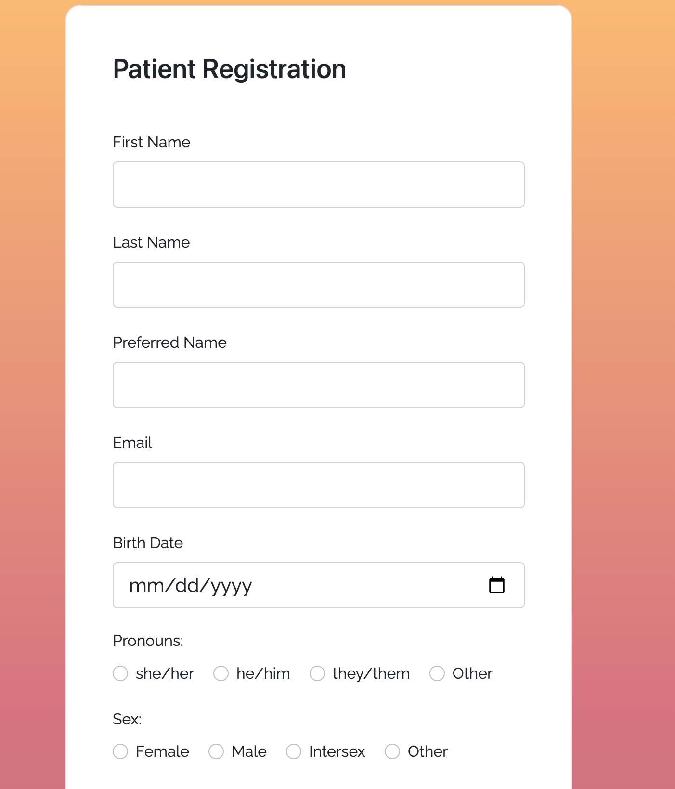

# EMRxpress

In the demanding, appointment-filled day, medical clinicians are required to accurately document patient visits in a time-efficient manner. Electronic Medical Record (EMR) software programs allow medical clinicians to log medical notes about each patients' complaint. Time efficiency and accuracy are essential.

EMRxpress seeks to streamline the medical documentation process by allowing patients to submit a Pre-Appointment Questionairre (PAQ). The PAQ allows a patient to answer relevant questions about their medical concern -- including the complaint itself (i.e. headache), the time they first experienced the complaint (i.e. 2 weeks), and the character of the complaint (i.e. sharp) -- prior to the visit. The clinician can view their patient's PAQ prior to an appointment, allowing the clinician to efficiently tailor questions to the complaint during the visit.

Similar to a traditional Electronic Medical Record program, EMRxpress gives a clinician the options to view/edit/cancel their appointments. In addition, patient users can schedule and view upcoming appointments.

## Usage
A patient may register using the following form. 

A patient may schedule an appointment as follows:

## Database
Database structure, via ER diagram:

## Technology
HTML, CSS, Bootstrap, JavaScript, Java, 
Spring, Lombok, Junit, SLF4J, MariaDB, 
Spring, Hibernate, JPA, Maven, Tomcat, JSP

## Questions
Feel free to contact me with questions at joshualj2018@gmail.com.